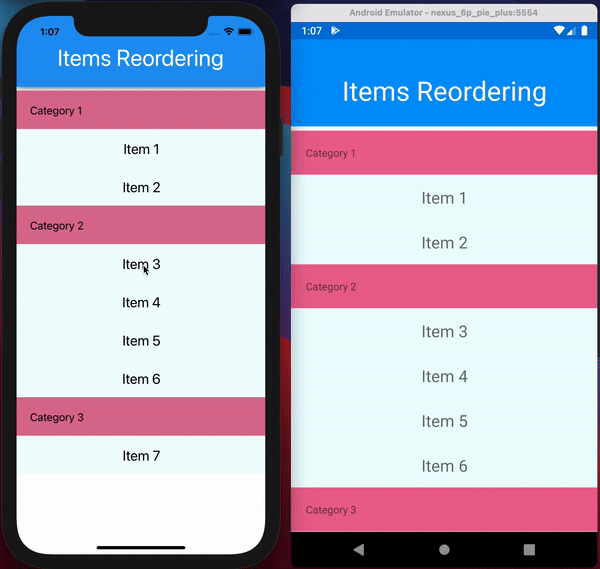

# CollectionView Drag & Drop Item Reordering with Gesture Recognizers

Items reordering in a list-based control is a pretty handy feature and it is used in various use cases. From simple scenarios like configuring settings, defining tabs order to complex scenarios like managing user content, and reordering images or email. With the recent [Xamarin.Forms 5.0][1] release, [Drag and Drop gesture recognizers][2] were introduced and enable you to unlock these scenarios in your app. In this post I will guide you through everything you need to add drag & drop to your CollectionView.

## Drag & Drop Gesture Recognizers

In previous posts you may have seen how drag and drop can be used with any control with the new gesture recognizers in Xamarin.Forms. However, views inside `CollectionView` organized by the control itself, are special and include caching and virtualization. These optimizations can break if you start moving views around. Don't worry those as gesture recognizers can still be used to work with the views indirectly. The recognizers have useful properties to bind them to commands with parameters:

<pre><code class="xml">    &lt;DragGestureRecognizer
        ...
        DragStartingCommand="{Binding ...}"
        DragStartingCommandParameter="{Binding ...}" /&gt;

    &lt;DropGestureRecognizer
        ...
        DragOverCommand="{Binding ...}"
        DragOverCommandParameter="{Binding ...}"
        DragLeaveCommand="{Binding ...}"
        DragLeaveCommandParameter="{Binding ...}"
        DropCommand="{Binding ...}"
        DropCommandParameter="{Binding ...}" /&gt;
</code></pre>

This is enough to track user requests to move one item to some other location. The `item` here is an element of a collection, bound to the `CollectionView` control. And if you can change the order of the items in the underlying collection, you can do the same with the new gesture recognizers.

## Reorder Items

First, you need a view model with a collection, where you want to reorder items. The items reordering logic is defined in C# with no UI-dependent code. A basic algorithm that takes one item of a collection and moves it in front of another item of the same collection. You need a few properties in the view model and the core reordering logic:

<pre><code class="csharp">    public ICommand ItemDragged { get; }
    public ICommand ItemDraggedOver { get; }
    public ICommand ItemDragLeave { get; }
    public ICommand ItemDropped { get; }

    private async Task OnItemDropped(ItemViewModel item)
    {
        var itemToMove = items.First(i =&gt; i.IsBeingDragged);
        var itemToInsertBefore = item;
        if (itemToMove == null || itemToInsertBefore == null || itemToMove == itemToInsertBefore)
            return;

        var categoryToMoveFrom = GroupedItems.First(g =&gt; g.Contains(itemToMove));
        categoryToMoveFrom.Remove(itemToMove);

        var categoryToMoveTo = GroupedItems.First(g =&gt; g.Contains(itemToInsertBefore));
        var insertAtIndex = categoryToMoveTo.IndexOf(itemToInsertBefore);
        itemToMove.Category = categoryToMoveFrom.Name;
        categoryToMoveTo.Insert(insertAtIndex, itemToMove);
        itemToMove.IsBeingDragged = false;
        itemToInsertBefore.IsBeingDraggedOver = false;
    }
</code></pre>

Next, to make it closer to a real-world example, the items in the `CollectionView` are grouped by category. And the algorithm above can drag items between categories:

<pre><code class="csharp">    public class ItemViewModel : ObservableObject
    {
        public string Category { get; set; }
        public string Title { get; set; }

        private bool isBeingDragged;
        public bool IsBeingDragged
        {
            get { return isBeingDragged; }
            set { SetProperty(ref isBeingDragged, value); }
        }

        private bool isBeingDraggedOver;
        public bool IsBeingDraggedOver
        {
            get { return isBeingDraggedOver; }
            set { SetProperty(ref isBeingDraggedOver, value); }
        }
    }
</code></pre>

Finally, you need to disable any Drag and Drop logic defined by the gestures using the `Drop` event. This ensures that only the logic defined by the view model is used to reorder items:

<pre><code class="csharp">    private void DropGestureRecognizer_Drop_Collection(System.Object sender, Xamarin.Forms.DropEventArgs e)
    {
        e.Handled = true;
    }
</code></pre>

## Summary

You can reorder items in a `CollectionView` by reordering items in the underlying collection bound to the `CollectionView`. The Drag and Drop gesture recognizers can help you to trigger the reordering logic, defined by a view model, that holds the collection. This solution doesn’t use any native code, the items reordering logic is defined in a view model while the gesture recognizers take advantage of the MVVM to communicate with that logic. You can also customize the look and feel for an item being dragged and a targeted area, everything in XAML with HotReload enabled. You can use this solution today with any collection-based control, taking [this sample repo][4] as a starting point.

## Useful links

1. [Collection View items reordering sample][4]
2. [Enhancement Support drag-and-drop reordering in CollectionView][5]
3. [Drag and Drop gesture recognizers docs][2]
4. [Drag and Drop gesture recognizers sample][6]
5. [CollectionView control][7]
6. [CollectionView grouping][8]

 [1]: https://devblogs.microsoft.com/xamarin/xamarin-forms-5-0-is-here/
 [2]: https://docs.microsoft.com/en-us/xamarin/xamarin-forms/app-fundamentals/gestures/drag-and-drop
 [3]: https://devblogs.microsoft.com/xamarin/wp-content/uploads/sites/44/2021/02/xamarinforms-collectionview-groupeditems-reordering.gif
 [4]: https://github.com/xamcat/grouped-list-reorder
 [5]: https://github.com/xamarin/Xamarin.Forms/issues/4676
 [6]: https://docs.microsoft.com/en-us/samples/xamarin/xamarin-forms-samples/workingwithgestures-draganddropgesture/
 [7]: https://docs.microsoft.com/en-us/xamarin/xamarin-forms/user-interface/collectionview/introduction
 [8]: https://docs.microsoft.com/en-us/xamarin/xamarin-forms/user-interface/collectionview/grouping